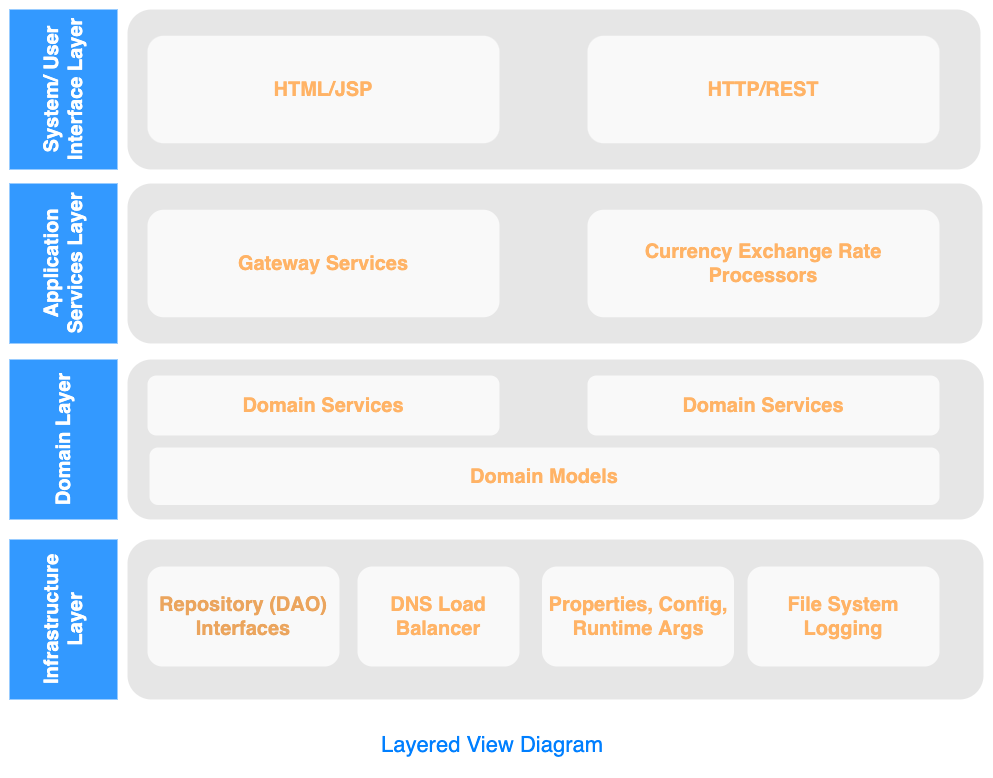

# Currency Exchange Rate Project (CurExRate Gateway)
> Most data providers suffers from performance and service availability issues. This system will address these issues using Asynchronous Request/Response and Queue-Based Load Leveling patterns.

## Table of Contents
* [System Overview](#system-overview)
* [Requirements](#requirements)
* [System Architecture](#system-architecture)
* [Software Detailed Design](#software-detailed-design)
* [External Interfaces](#external-interfaces)
* [Motivation For Choosing The API](#motivation-for-choosing-the-api)
* [Setup](#setup)
* [Usage](#usage)
<!-- 
* [Data Architechture](#data-architecture)
* [Deployment View](#deployment-view)
* [Project Status](#project-status)
* [Room for Improvement](#room-for-improvement)
* [Acknowledgements](#acknowledgements)
* [Contact](#contact)
* [License](#license) -->

## System Overview
The Currency Exchange Rate (CurExRate) Gateway is a software as a service (SAAS) solution that provides a single entry point for the latest and historical currency exchange rates from different data service providers.

### System Context
The following diagram shows the system context view of the entire system.

## Requirements
### Non-Functional Requirements
This section documents a summary of those requirements that address aspects of the system besides functionality and that are relevant for the system architecture.
#### Qualities
There are some key requirements that have a significant bearing on the architecture. They are:

- High Availability or Reliability - Service continuity will be addressed by supporting more than one (1) data service providers.
- Performance - Request and Response should have a throughput of more than 1000 per second.
- Scalability - On demand growth of service’s capacity and decreasing processing time will be addressed by applying the three dimensional scalability model of scale cube.
#### Constraints
- CentOs Server
- JDK 1.8 or obove
- Spring Framework 1.4.1 or above
- RabbitMQ 3.5.7 or above
- MongoDB 3.4.5 or above

#### Principles
- Loosely Coupled
- High Cohesion
- Scale By Cloning
- Work Distribution
### Functional Requirements
#### Use Case View
The general functionality of the CurExRate gateway can be seen in the following use case diagram:

## System Architecture
### Layered View
As with any other things, a style may be used to satisfy any functional, non-functional or aesthetic needs in a software system. The CurExRate Gateway, follows the four-layer architectural style: user interface layer, application services layer, domain layer, and the infrastructure layer.  The following is a simple description of what will be included in each of the layers:

#### System/User Interface Layer
This layer wraps access to the logic of the system. There are two categories of interface class - user interface (UI) classes that provide people access to the system and the system interface (SI)  classes that allows service consumers to access the service provided by the system.
#### Application Services Layer
This layer implements business logic that involves collaborating with several domain classes or even other process and mediates between the various system/user interface components that is responsible for the flow and control of the application.
#### Domain Layer
This is the layer where most objects found in an OO analysis and design will reside.  Implementation of objects pertinent to your problem domain including the behaviors specific to individual objects that will drive the system.
#### Infrastructure Layer
This is where the objects that represent connections to entities outside the application (specifically those outside the object world) reside such as connections to databases or repositories and message broker. 

## Software Detailed Design
This subsection will describe the overall decomposition of the CurExRate gateway design model as well as the interactivity that happens between components.
### SubSystems

### Components
There are three collaborating components that compose the entire system. Each component running as a microservice are the following.

<!--
The CurExRate Gateway provides access to the latest and historical currency exchange rates and supported currency symbols. The gateway consists of REST interface for application integration, intranet Web interface for monitoring and application control and service specific client processors for consuming third party API. The following are the major System Functional Components:

* Develop an Asynchronous Request/Response REST services for the system's integration with other applications.
* Integrate to more than one(1) currency exchange rate data providers.
* Develop an intranet accessible only web application for system monitoring and application control.

The following diagram outlines the high level major components of the CurExRate Gateway; each component is described in the following sections below the diagram.

- CurExRate Request Service
- CurExRate Status Service
- CurExRate Data Service

-->
    
## External Interfaces
### Request Service Endpoint (http://localhost:18180/exchangeRate)
Request GET Parameters
Name | Description | Example |
|---|--------|------|
| base | [optional] Changing base currency. Enter the three-letter currency code of your preferred base currency.  | base=USD |
| symbols | [optional] Enter a list of comma-separated currency codes to limit output currencies.  | symbols=USD,EUR,PHP |
| date | [optional] Query historical rates for a givin date | date=2020-04-04 |
| amount | [optional] The amount to be converted.  | amount=1200 |
| places | [optional] Round numbers to decimal place. | places=2 |

Successfull Response

HTTP Status 202 (Accepted)

Response Headers
| Name | Description | Example |
|---|--------------|---------|
|resourceId|universally unique identifier (UUID)| resourceId=123e4567-e89b-12d3-a456-426614174000 |
|processingTime|Estimated Processing Time|processingTime=1000 |

Error Responses

HTTP Status 404 (Not Found)

### Response Service Endpoint (http://localhost:18280/exchangeRateResponse)
Request GET Parameters
Name | Description | Example |
|---|--------|------|
| resourceId |universally unique identifier (UUID)| resourceId=123e4567-e89b-12d3-a456-426614174000 |

Successfull Response

HTTP Status 200 (OK)

Response Body

Error Responses

HTTP Status 404 (Not Found)

## Motivation For Choosing The API
- Fulfilment Of All Required Functionalities such as listings of available currencies symbols and querying latest and historial exchage rates.
- Documentation with clear and useful examples written in such a way that we can get the gist of ​​how it works at a glance and thus see in which it is easier to apply such instructions to avoid wasting time and effort.
- JSON Data Format has been leading the way in terms of data representation formats for APIs for quite some time. One of its benefits is that it can be easily read by humans and it is also easier to implement.
- Examples and Libraries of code in the programming language that we are using or a library that “talks” with the API in the language in question must given by the provider.- Limits And Interactions- Support And Community forum offers by the provider must have a good reputation for solving problems in a timely and relevant manner.
- A free service with a potential to grow rapidly must be designed and implemented with Scalability and High Availability. 

**[⬆ Back to Table Of Contents](#table-of-contents)**
